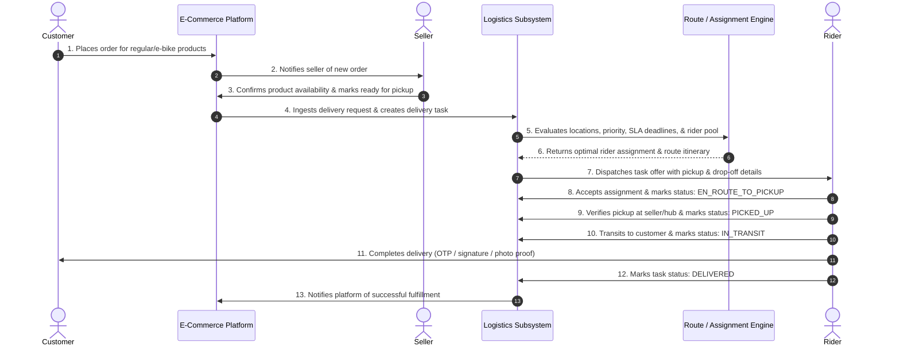
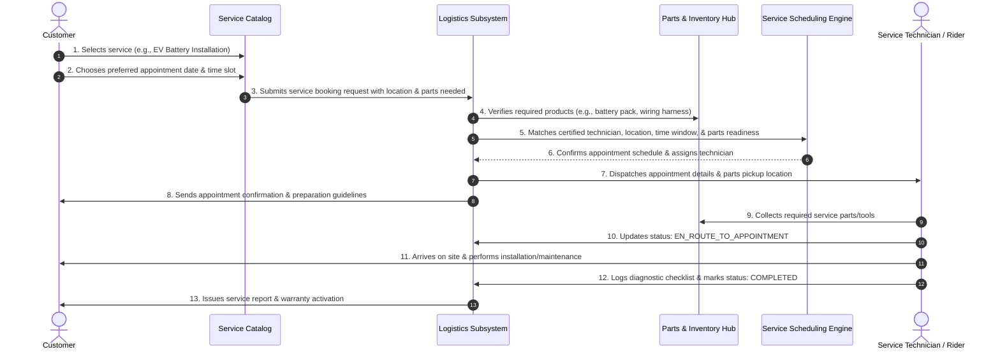

# Logistics & Services Optimization Module

## Part 1 — Logistics Requirements and Workflow

---

### 1. Project Overview

The **Logistics and Services Optimization System** is a mission-critical subsystem of the **Quantum Algorithm-Based E-Commerce Platform**. The platform is designed as an end-to-end commerce and fulfillment ecosystem supporting:
- **Regular Bicycles and Bikes**: Traditional pedal bikes, performance bicycles, accessories, spare parts, and mechanical gear.
- **Electric Bikes (E-Bikes)**: Electric bicycles, lithium-ion battery units, smart drive systems, motors, and charging hardware.
- **Products & Consumables**: Spare components, safety equipment, replacement parts, and maintenance kits.
- **On-Site & Workshop Services**: Specialized technical services including EV battery assembly and installation, powertrain diagnostics, preventative maintenance, roadside support, and warranty tune-ups.

#### Strategic Objective
To orchestrate high-efficiency, SLA-compliant dispatching, delivery routing, and technician scheduling by establishing a deterministic classical operational baseline and integrating cutting-edge quantum and hybrid quantum-classical optimization algorithms for complex multi-stop routing and constrained service scheduling.

```
+-----------------------------------------------------------------------------------+
|               Quantum Algorithm-Based E-Commerce Platform                         |
+-----------------------------------------------------------------------------------+
|  Storefront & Orders  |  Rider Panel  |  Database & Core  |  Quantum Solvers      |
|  (Product & Service)  |  (Amrutha)    |  (Vamsi / Pushpam)|  (Harshitha & Hema)   |
+-----------------------------------------------------------------------------------+
|               [ Logistics & Services Optimization Module ]                        |
|   - Delivery Management        - Rider Workload & Capacity                        |
|   - Route Optimization         - Service Appointment Scheduling                   |
|   - Dynamic Reassignment       - Classical Baseline & Hybrid Optimizer Bridge    |
|   - MCP Integration Tools                                                         |
+-----------------------------------------------------------------------------------+
```

---

### 2. Product Delivery Workflow

The product delivery workflow governs the end-to-end lifecycle of physical goods fulfillment—from customer purchase to final drop-off and proof-of-delivery verification.



#### Detailed Workflow Steps:
1. **Order Placement**:
   - Customer completes checkout on the e-commerce platform for products (e.g., e-bike batteries, helmets, bicycle drive chains).
   - Order metadata is published with destination geocodes, delivery tier (Standard vs. Express), and delivery time preferences.
2. **Seller Confirmation & Readiness**:
   - The seller or fulfillment hub receives the order notification.
   - Seller validates inventory, packages the item, and triggers the `READY_FOR_PICKUP` signal with warehouse/store address and parcel physical parameters (weight, dimensions).
3. **Logistics Intake**:
   - The Logistics Subsystem receives the delivery request via an internal event/API.
   - A new `Delivery` entity is registered in the state machine with status `PENDING`.
4. **Constraint Validation & Opportunity Evaluation**:
   - System analyzes geolocations (pickup vs. drop-off), transit distance, package weight/cargo size, deadline thresholds, and current rider pool availability.
5. **Rider Assignment & Route Planning**:
   - The optimization engine matches the delivery to an optimal rider based on proximity, vehicle capability, and active workload.
   - An optimized multi-stop route itinerary is generated.
6. **Rider Execution & Real-Time Tracking**:
   - The selected rider accepts the task via the rider app.
   - The rider transitions through discrete milestones: `ACCEPTED` -> `EN_ROUTE_TO_PICKUP` -> `PICKED_UP` -> `IN_TRANSIT` -> `DELIVERED`.
   - Completion requires verified proof of delivery (e.g., customer OTP confirmation or digital signature).

---

### 3. Service and Installation Workflow

The service workflow manages skilled field operations, such as EV battery replacements, electrical system diagnostics, motor tuning, and bicycle assemblies requiring both an available technician and synchronized parts logistics.



#### Detailed Workflow Steps:
1. **Service Selection**:
   - Customer selects an eligible service from the platform catalog (e.g., EV Battery Upgrade/Installation, Brake Overhaul, Full Drivetrain Tune-up).
2. **Appointment Slot Selection**:
   - Customer chooses an open time slot and designates the service address (home, office, or authorized local service point).
3. **Resource & Component Coordination**:
   - The Logistics Subsystem cross-references the appointment requirements against technical certifications (e.g., high-voltage EV battery certified) and inventory status for mandatory parts (e.g., specific battery model, mounting bracket).
   - If parts must be delivered to the location ahead of time or collected by the technician en route, combined product-service routing is generated.
4. **Appointment Tracking & Service Execution**:
   - The appointment state machine transitions through: `SCHEDULED` -> `TECHNICIAN_ASSIGNED` -> `PARTS_ACQUIRED` -> `EN_ROUTE` -> `IN_PROGRESS` -> `COMPLETED`.
   - The technician executes a standardized digital inspection checklist, records battery serial numbers/diagnostic metrics, and obtains customer sign-off.

---

### 4. Core Features

| Feature Name | Description | Key Capabilities |
|---|---|---|
| **Delivery Task Management** | End-to-end lifecycle management of all physical shipment tasks. | Task creation, parcel dimensioning, priority escalation (Standard/Express), status transitions, SLA monitoring. |
| **Rider Availability & Workload Management** | Real-time tracking of rider operational states and current load. | Online/offline/break toggles, shift hours enforcement, active delivery counter, weight/volume capacity limits. |
| **Rider Assignment Engine** | Algorithmic matching of deliveries and services to qualified riders. | Distance-based filtering, skill/vehicle capability verification, capacity-checked assignment, load balancing. |
| **Route Optimization** | Multi-stop trajectory planning for riders and field technicians. | Minimization of transit distance and time, turn-by-turn waypoint sequencing, vehicle-specific routing (bike lanes vs. roads). |
| **Service Appointment Coordination** | Harmonization of customer appointment windows with technician availability. | Time-slot reservation, multi-resource synchronization (technician + replacement parts), technician skill matching. |
| **Delivery Tracking & Rescheduling** | Transparency and resilience against real-world fulfillment disruptions. | Live ETA estimation, customer milestone notifications, SLA breach warnings, automated exception handling and re-booking. |
| **Classical & Quantum/Hybrid Optimization Integration** | Dual-tier optimization architecture. | Classical heuristics (OR-Tools, Clarke-Wright, Simulated Annealing) as the operational baseline; hybrid quantum (QUBO/QAOA/VQE) for complex combinatorial scenarios. |
| **MCP Integration for Approved Logistics Operations** | Standardized Model Context Protocol tool endpoints for AI agent interactions. | Secure read/write tools for delivery querying, schedule inspection, route retrieval, and supervisor-approved reassignment triggers. |

---

### 5. Core Entities

*Note: Conceptual domain modeling only. Database schemas and ORM models will be finalized in later phases in coordination with the database team.*

#### 5.1 Delivery
- **Purpose**: Represents an individual package fulfillment request from a merchant/hub to a customer.
- **Important Fields**:
  - `delivery_id`: Unique identifier for the delivery task.
  - `order_id`: Reference to parent e-commerce order.
  - `customer_id`: Reference to recipient profile.
  - `seller_id` / `hub_id`: Origin merchant or fulfillment depot identifier.
  - `pickup_address`: Geolocation (latitude, longitude) and street address of pickup.
  - `dropoff_address`: Geolocation (latitude, longitude) and street address of recipient.
  - `package_weight_kg`: Weight of package (must not exceed rider capacity).
  - `package_dimensions`: Dimensional metrics (length, width, height) and volume.
  - `delivery_tier`: Priority level (`STANDARD`, `EXPRESS`, `SAME_DAY`).
  - `time_window_start`: Earliest acceptable delivery time.
  - `deadline`: Hard delivery deadline / SLA commitment.
  - `status`: Discrete lifecycle stage (`PENDING`, `ASSIGNED`, `PICKED_UP`, `IN_TRANSIT`, `DELIVERED`, `FAILED`, `CANCELLED`).
  - `proof_of_delivery`: Verification payload (OTP hash, customer signature URL, photo proof).
  - `created_at` / `updated_at`: Audit timestamps.

#### 5.2 Rider
- **Purpose**: Represents a delivery partner or mobile field technician participating in the fulfillment network.
- **Important Fields**:
  - `rider_id`: Unique identifier for the rider.
  - `user_id`: Reference to authentication/account profile.
  - `name`: Full name of the rider.
  - `contact_phone`: Verified contact number.
  - `vehicle_type`: Transport mode (`REGULAR_BIKE`, `ELECTRIC_BIKE`, `CARGO_EBIKE`, `VAN`).
  - `skill_certifications`: List of validated technician capabilities (e.g., `["EV_BATTERY_INSTALL", "MECHANICAL_TUNEUP"]`).
  - `current_location`: Real-time GPS coordinate (`latitude`, `longitude`, `timestamp`).
  - `status`: Real-time operational state (`AVAILABLE`, `BUSY`, `ON_BREAK`, `OFFLINE`).
  - `max_payload_kg`: Upper weight threshold the vehicle/rider can transport.
  - `max_active_orders`: Maximum concurrent deliveries allowed simultaneously.
  - `active_order_count`: Current count of orders in transit or assigned.
  - `shift_start` / `shift_end`: Daily operational schedule boundaries.
  - `performance_rating`: Composite rating score for assignment weighting.

#### 5.3 Rider Assignment
- **Purpose**: Represents an explicit dispatch binding associating a specific rider with a delivery task or service appointment.
- **Important Fields**:
  - `assignment_id`: Unique identifier for the assignment record.
  - `rider_id`: Reference to assigned rider.
  - `task_type`: Nature of assignment (`PRODUCT_DELIVERY` or `SERVICE_APPOINTMENT`).
  - `task_id`: Foreign key reference to either `delivery_id` or `appointment_id`.
  - `assigned_at`: Timestamp when the system offered or bound the task.
  - `accepted_at`: Timestamp when the rider accepted the dispatch offer.
  - `status`: Assignment state (`OFFERED`, `ACCEPTED`, `REJECTED`, `IN_PROGRESS`, `COMPLETED`, `REASSIGNED`).
  - `reassignment_reason`: Diagnostic rationale if reassignment occurred (e.g., `TIMEOUT`, `VEHICLE_BREAKDOWN`, `REJECTED_BY_RIDER`).
  - `sequence_order`: The waypoint sequence order within the rider's overall active route.
  - `estimated_arrival_time`: Target ETA computed by route optimizer.

#### 5.4 Service Appointment
- **Purpose**: Represents a scheduled technical service, installation, or maintenance booking.
- **Important Fields**:
  - `appointment_id`: Unique identifier for the service booking.
  - `order_id`: Reference to parent order.
  - `customer_id`: Customer receiving the on-site service.
  - `service_type`: Service category (`EV_BATTERY_INSTALLATION`, `BRAKE_MAINTENANCE`, `MOTOR_DIAGNOSTICS`, `GENERAL_TUNEUP`).
  - `service_location`: Geolocation (latitude, longitude) and customer address.
  - `scheduled_date`: Date of the appointment.
  - `slot_start` / `slot_end`: Time window committed to the customer.
  - `required_product_ids`: Array of products/parts needed for installation (e.g., battery pack SKU).
  - `assigned_technician_id`: Reference to certified rider/technician assigned.
  - `status`: Appointment lifecycle stage (`SCHEDULED`, `ASSIGNED`, `PARTS_EN_ROUTE`, `IN_PROGRESS`, `COMPLETED`, `RESCHEDULED`, `CANCELLED`).
  - `completion_checklist`: Structured completion data (battery serial number, diagnostic checklist, test-drive confirmation).
  - `customer_signoff`: Digital signature or acceptance code from customer.

#### 5.5 Route / Optimization Result
- **Purpose**: Captures the computed multi-stop itinerary and dispatch output generated by the optimization engine.
- **Important Fields**:
  - `route_id`: Unique identifier for the planned route.
  - `rider_id`: Assigned rider for this itinerary.
  - `optimizer_engine`: Solver identifier (`CLASSICAL_BASELINE`, `QUANTUM_QUBO_HYBRID`).
  - `waypoints`: Ordered array of stop nodes with target arrival time, stop type (`PICKUP`, `DROPOFF`, `SERVICE`), and entity references.
  - `total_distance_km`: Aggregate route distance.
  - `total_estimated_duration_min`: Aggregate travel and service duration.
  - `energy_consumption_estimate`: Projected battery/energy expenditure for e-bikes.
  - `objective_cost_score`: Objective function value (combination of distance, time, penalty weights).
  - `solver_metadata`: Solver performance metrics (computation time in ms, quantum qubit count/shots if applicable, convergence status).
  - `status`: Route execution state (`PLANNED`, `ACTIVE`, `MODIFIED`, `COMPLETED`).
  - `computed_at`: Timestamp of computation.

---

### 6. Initial Business Rules

1. **Rider Availability Constraint**:
   - Only riders with status `AVAILABLE` and within their designated active shift window (`shift_start` <= current_time <= `shift_end`) can receive new assignments.
2. **Multi-Constraint Feasibility**:
   - Every candidate assignment must satisfy all hard constraints:
     - Distance and travel time within SLA deadline limits.
     - Cumulative package weight must not exceed `max_payload_kg`.
     - Active task count must not exceed `max_active_orders`.
     - Technician must possess active certifications matching the required `service_type`.
3. **Overload Prevention**:
   - The system must reject automatic task assignment if the rider's queue is full, preventing delivery delays, rider exhaustion, and safety hazards.
4. **Dynamic Reassignment & Failover**:
   - If an assignment offer is rejected or ignored beyond the acceptance timeout (e.g., 90 seconds), the assignment state is set to `REASSIGNED` and immediately dispatched to the next best candidate.
   - In case of reported vehicle failure or rider emergency, active tasks must be dynamically recalled and rescheduled or split across nearby available riders.
5. **Immutable Audit & Status History**:
   - All state transitions across deliveries, appointments, and rider assignments must generate immutable audit events capturing timestamp, previous state, new state, actor, and contextual notes.
6. **Classical Baseline First Strategy**:
   - The system must execute all routing and assignment logic through deterministic classical solvers (e.g., Google OR-Tools / Clarke-Wright Savings) first.
   - The classical solution serves as the immediate fallback, production safety net, and benchmark against which quantum/hybrid solvers are validated.

---

### 7. Team Dependencies

| Team Member(s) | Primary Responsibilities | Logistics Integration Points |
|---|---|---|
| **Harshitha & Hema** | Quantum Algorithms & Optimization | Formulate QUBO/Ising models for Vehicle Routing Problem with Time Windows (VRPTW) and Job Shop Scheduling; build quantum-classical hybrid solvers; benchmark quantum solutions against classical baselines. |
| **Amrutha** | Rider Panel & Frontend Integration | Build mobile-responsive rider web interface; implement rider status toggles (Available/Offline), task acceptance modals, turn-by-turn route view, and delivery/appointment completion flows. |
| **Vamsi** | Database Architecture & Relationships | Implement relational/NoSQL schemas, indices, spatial geometry queries (PostGIS/geohash), foreign key integrity, and migration pipelines for logistics entities. |
| **Pushpam** | Backend Integration & Cloud Deployment | Design REST/WebSocket API endpoints, authentication middleware (JWT/RBAC), message queues (Redis/RabbitMQ) for asynchronous logistics events, CI/CD, and deployment infrastructure. |
| **Viswanath** | Logistics Workflow, Service Coordination, Rider Assignment & Optimization Integration | Lead logistics requirements and domain architecture; develop assignment logic and service appointment coordination; build bridges to classical and quantum optimizers; implement logistics MCP tools. |

---

### 8. Scope and Deliverables

#### Current Phase Scope (Part 1):
- Comprehensive requirements specification, domain entity design, and workflow architecture.
- Definition of operational state machines and initial business rules.
- Team dependency mapping and architectural boundary definition.

#### Future Phase Deliverables (Out of Scope for This Task):
- Database schema implementation, migrations, and ORM entity classes (Vamsi / Database).
- REST/GraphQL/WebSocket API controllers, microservices, and deployment scripts (Pushpam / Backend).
- Quantum QUBO formulation, hybrid quantum algorithm coding, and Qiskit/D-Wave integration (Harshitha & Hema / Quantum).
- Rider panel user interfaces and mobile web views (Amrutha / Rider Panel).
- MCP tool runtime server execution and automated background workers.

#### Requirements to Confirm with the Team Before Implementation:
1. **Geolocation & Spatial Storage Format** *(with Vamsi)*:
   - Determine whether locations will be stored as PostGIS `GEOMETRY(Point, 4326)`, raw `(latitude, longitude)` floats, or geohashes for spatial indexing.
2. **Real-Time Communication Protocol** *(with Pushpam & Amrutha)*:
   - Confirm protocol for live rider location updates and instant dispatch notifications (WebSockets, Server-Sent Events, or MQTT).
3. **Quantum Solver Interface Contract** *(with Harshitha & Hema)*:
   - Establish standard JSON payload contract for the optimization problem instance (distance matrix, time windows, capacity constraints, objective weights) and expected solution schema.
4. **Service Technician vs. Delivery Rider Modeling** *(with Amrutha & Pushpam)*:
   - Confirm if technicians and riders share the same base `Rider` profile with different capability tags, or if they require distinct user roles and permissions in the authentication service.
5. **Dispatch Acceptance SLA & Timeout Window**:
   - Finalize the timeout threshold before auto-reassignment (e.g., 60s vs. 120s) and rider penalty/re-routing policy.
6. **MCP Tool Capabilities & Security Policy**:
   - Confirm exact tool specifications and authorization rules for Model Context Protocol (MCP) agents interacting with logistics state.
